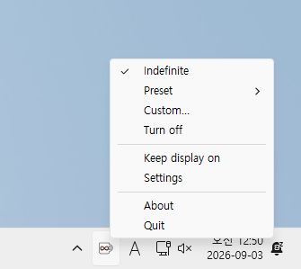
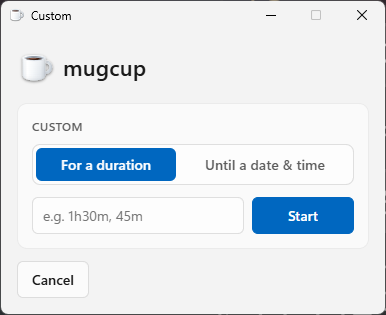
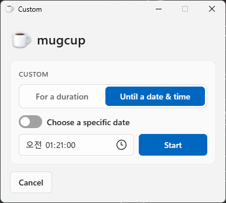
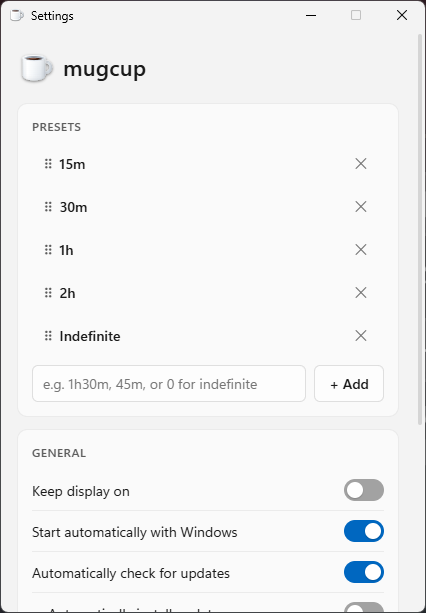

<h1 align="center">
  <br>
  mugcup
</h1>
<p align="center"><i>An overengineered caffeine pill for Windows.</i></p>

<p align="center">
  
  
  
</p>

mugcup is a tray app that stops your PC from sleeping, locking, or dimming
the screen — for a duration, until a specific time, indefinitely, or via
one-click presets you define. Think of it as topping up a mug of coffee next
to your keyboard: as long as it's full, the machine stays up. No more nudging
the mouse every few minutes during a long build, a presentation, or a movie
you are *definitely* still watching.

Under the hood, the entire job reduces to one Windows API call —
[`SetThreadExecutionState`](src/power/power.go). And yet mugcup is pushing
3,200+ lines of Go for the GUI alone (4,200+ counting the CLI): presets,
schedules, self-updating releases, full i18n, persisted/importable config,
and a scriptable twin binary. It takes its one job very seriously.

## 📦 Installation

1. Grab a zip from [the latest release](https://github.com/kimiroo/mugcup/releases/latest) for your architecture. Not sure which one? Grab `amd64` — that's almost certainly your PC.
2. Unzip it wherever you want. No installer, no admin prompt.
3. Run `mugcup.exe`.

That's the whole install. Autostart, updates, and everything else live in the app itself.

The only prerequisite is the WebView2 Runtime, which the Settings/Custom/About
windows render through — already on your machine if you have Edge (i.e.
basically every Windows 10/11 install). mugcup checks for it and warns you if
it's somehow missing.

## ☕ The GUI

mugcup lives in the tray. Click the icon for the full menu — and what a
*click* does is itself configurable: cycle through your presets, toggle
indefinite mode, or just pop the menu open. Pick whichever fits your muscle
memory in Settings.

<p align="center">
  
</p>

- **Indefinite** — keep the machine awake until you say stop.
- **Preset** — jump straight to a saved duration (`15m`, `30m`, `1h`, …).
- **Custom…** — pick your own duration or an exact until-time.
- **Keep display on** — also block the screen from turning off, not just sleep.
- **Settings** / **About** (version info, manual "Check for Updates") / **Quit**.

### Custom timers

One window, two tabs — run for a duration (`1h30m`, `45m`, …) or until an
exact date & time (wake me at 9&nbsp;AM tomorrow):

<p align="center">
  
  
</p>

### Settings

Everything's configurable from one window:

<p align="center">
  
</p>

- Reorderable **preset list** — drag to reorder, add or remove your own.
- **Keep display on**, **start with Windows**, and **auto-update** toggles.
- Pick a **language** manually or follow the OS.
- Choose **what clicking the tray icon does**: cycle presets, toggle indefinite,
  or just open the menu.

## 🧰 The CLI

```text
>mugcup-cli.exe --help
mugcup-cli - CLI for controlling the running mugcup tray app

Usage:
  mugcup-cli <command> [args] [options]

Commands:
  launch                  Start mugcup (no-op success if already running).
                            --no-update skips its startup auto-update check
  start <time>             Keep on for the given duration (e.g. 30m, 1h, 2h15m). Required — no default
  start indefinite         Keep on indefinitely
  start preset <n>         Start the n-th preset from the configured list (0-based)
  start until <time>       Keep on until the given time today (e.g. 18:00), a specific date & time
                            (e.g. 2026-01-02 18:00, quoted if it has a space), or an RFC3339
                            timestamp (e.g. 2026-01-02T18:00:00+09:00). Must be in the future
  stop                     Turn off the timer and keep-on
  set                      Change settings that aren't tied to a running timer (see Options below).
                            Requires at least one of -d, --auto-start, --auto-update-check,
                            --auto-update-apply, --language, --tray-click-action
  config                   Show the current config
  settings                 Open the settings window
  status                   Show the current status
  update                   Check for updates, and if one is found, ask [y/N] before installing
                            (-y/--yes skips the prompt and installs immediately)
  exit                     Exit the running mugcup
  import <path.json>       Read a config file and apply it (stdin if omitted)
  export <path.json>       Save the current config to a file (stdout if omitted)
  version                  Show mugcup-cli's own version and build variant
  help                     Show this help

Options:
  -d, --display-on <true|false>      Also keep the display on. Persists; unlike the others, only has an
                                     on-screen effect while a timer is running (omit to keep the current setting)
  --auto-start <true|false>          Start mugcup automatically with Windows
  --auto-update-check <true|false>   Automatically check for updates
  --auto-update-apply <true|false>   Install a found update without asking (only takes effect if
                                     auto-update-check is also on)
  --language <auto|en|ko>            Set the GUI's display language (tray menu, popup window, dialogs).
                                     Doesn't affect mugcup-cli's own output, which stays English-only
  --tray-click-action <cycle|indefinite|menu>
                                     What a tray left-click does: cycle through presets, toggle
                                     indefinite keep-on, or just open the tray menu
  -y, --yes                          Skip the "update" command's [y/N] confirmation
  --no-update                        With "launch": start mugcup without its startup auto-update check
  -o, --output <text|json>           Output format. start/stop/set/status/config/export/import
                                     print the result as multiple lines (text) or just that value (json)

Examples:
  mugcup-cli launch
  mugcup-cli launch --no-update
  mugcup-cli start 1h30m
  mugcup-cli start preset 0
  mugcup-cli start until 18:00
  mugcup-cli start until "2026-01-02 18:00"
  mugcup-cli start indefinite -d true
  mugcup-cli set --auto-start true --auto-update-apply false
  mugcup-cli set --language ko
  mugcup-cli set --tray-click-action cycle
  mugcup-cli status -o json
  mugcup-cli export config.json
  mugcup-cli update
  mugcup-cli update -y
  mugcup-cli exit
```

This is where mugcup stops looking like a caffeine app. `mugcup-cli.exe` is
a full IPC client, not a thin wrapper around one or two commands: every knob
in the Settings window — presets, autostart, auto-update channel, display
behavior, tray click action, language — round-trips through it. `export`/
`import` dump and restore the *entire* config as JSON, so it's
version-controllable and portable across machines; `status -o json` gives
you a scriptable read on what's currently running.

`mugcup.exe` (GUI) and `mugcup-cli.exe` (CLI) are separate Go modules built
independently. Launch `mugcup.exe` with arguments and it won't try to parse
them — it just points you at `mugcup-cli.exe` and exits. Every CLI command
except `launch`/`exit` requires `mugcup.exe` to already be running.

## 🔬 Advanced (for nerds)

Everything mugcup persists lives under `%APPDATA%\mugcup`:

- `config.json` — your settings (presets, toggles, language, …)
- `state.json` — the currently active timer, so a restart can resume it
- `logs\mugcup.log` — a rotating log (5&nbsp;MB × 3 backups, kept 30 days) shared by every subsystem

These are plain JSON/text, handy to peek at while debugging. Don't hand-edit
`config.json` directly, though — `config.json` is only read once at startup,
so edits while mugcup is running won't take effect until a restart, and can
get silently clobbered by the next save from the app anyway. Go through the
Settings window or `mugcup-cli.exe export`/`import` instead: both apply
changes to the live process immediately and validate the schema before
writing.

## 🏗️ Building

```powershell
.\build.ps1
```

Produces two files per target architecture: `mugcup.exe`, the tray GUI (no
console window), and `mugcup-cli.exe`, the console CLI. Default architectures
are `amd64`, `x86`, and `arm64` — all three, every time.

`build.ps1` also takes a few params for one-off builds:

```powershell
.\build.ps1 -Architectures amd64,arm64   # only build for these
.\build.ps1 -Version 0.2.0-beta.1 -Variant beta
```

`-Version`/`-Variant` are baked into the binaries and checked by self-update
([src/update/update.go](src/update/update.go)). They default to
[`version.yaml`](version.yaml), which is the recommended way to set them for
an actual release — bump the file, commit it, tag it. The flags exist mainly
to override that for a quick local/dev build without touching the file.

## 🌐 Language

mugcup currently speaks English and Korean ([`src/i18n`](src/i18n)), auto-detected
from your OS language. Each locale is a ~100-string catalog — PRs adding a
new one are very welcome.

## 🤖 A note on AI

A large chunk of this codebase was written with heavy AI assistance. AI-assisted
PRs are welcome too, under the same common-sense rules a lot of projects are
settling on these days:

- **Disclose it.** Mention in the PR description if AI wrote some or all of it.
- **Understand what you're submitting.** You should be able to explain any
  line of your diff and defend the design choices — "the model wrote it" is
  not an answer to a review comment.
- **You own it.** Correctness, security, and quality are your responsibility,
  not the tool's.
- **No unreviewed drive-bys.** Read the diff, build it, and confirm it does
  what it claims before opening the PR — don't paste raw model output and
  walk away.

Low-effort, unreviewed AI submissions get closed without much ceremony.
Thoughtful ones — AI-assisted or not — are very welcome.

## 📄 License

Licensed under the [EUPL](LICENSE).
